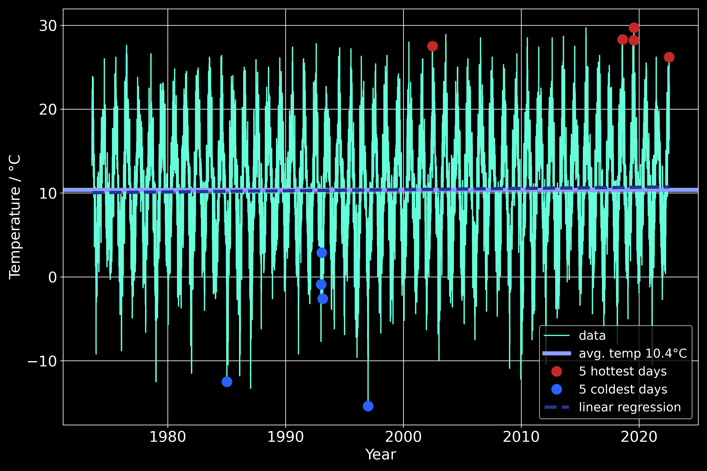
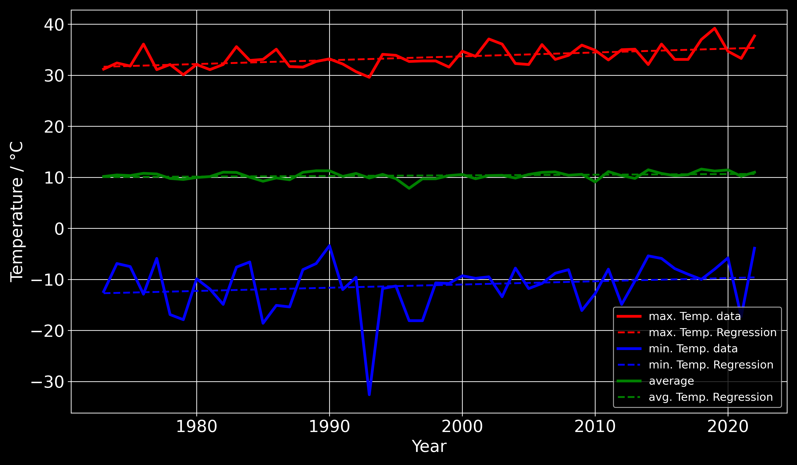

# Climate-Analysis: Make your own Climate Analysis

## Download weather data
pending

## Example climate analysis: Dortmund from 1973 to 2022

### I. Progress of the *daily* mean temperature

- 4 from 5 days with highest maximum daily temperature were after or in 2019
- all 5 days with the minimum daily temperature were before or in 1997
- mean temperature: 10.37 °C

### II. Timeline of the *yearly* minimum, maximum and average temperature

- increase of annual max. Temperature in ten years: 0.75 °C
- increase of annual min. Temperature in ten years: 0.18 °C
- increase of annual avg. Temperature in ten years: 0.54 °C

## Export Jupyter Notebook
- HTML (dark theme)

  `jupyter nbconvert Report_Dortmund_2022.ipynb --to html --HTMLExporter.theme=dark`

- PDF (white, article)

  `jupyter nbconvert --to pdf Report_Dortmund_2022.ipynb`

## Todo
- [x] config file: metric, key, ...
- [ ] analyze windspeed
- [ ] analyze rain and snow

## Data Source
https://www.visualcrossing.com/
